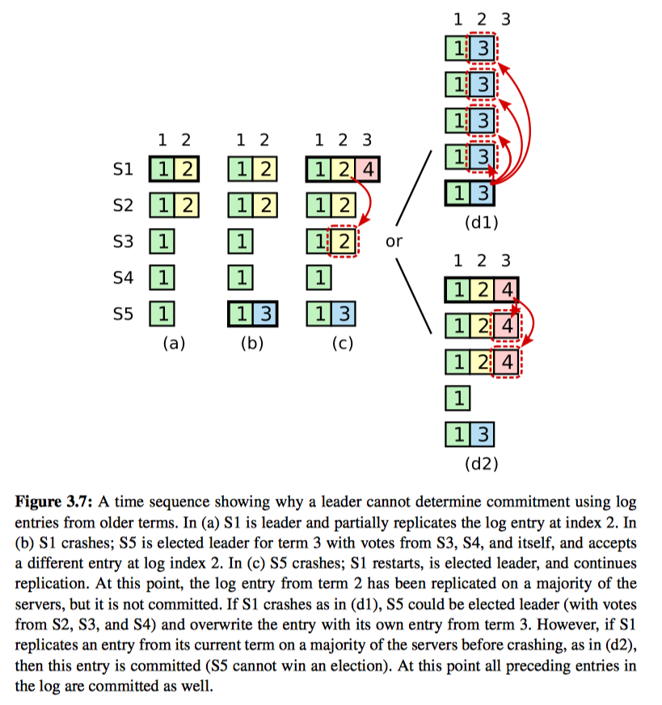

### 安全 ###

如果一台机器**应用**了一条日志，那么其他的机器就无法**应用**具有相同ID但不同命令的日志。

Election Safety:

> At most one leader can be elected in a given term. §3.4

Leader Append-Only:

> A leader never overwrites or deletes entries in its log; it only appends new entries. §3.5

Log Matching:

> If two logs contain an entry with the same index and term, then the logs are identical in all entries up through the given index. §3.5

Leader Completeness:

> If a log entry is committed in a given term, then that entry will be present in the logs of the leaders for all higher-numbered terms. §3.6

State Machine Safety:

> **Most Important**:
> If a server has applied a log entry at a given index to its state machine,
> no other server will ever apply a different log entry for the same index.§3.6.3


### 3.3 基本说明

两种操作：

- RequestVote
- AppendEntries


### 3.4 选举

**心跳机制触发选举:**
节点启动时，是 Follower 状态。
如果一直都能收到来自 Candidate 或者 Leader 的请求，那么就会保持在  Follower 状态。
如果在一个随机的时间内，没有收到任何请求，节点就会假设现在没有合适的Leader，它就会发起一个 ReqeustVotes 请求给其他节点，要求成为 Leader。这个时候的节点状态称作 Candidate。

这会有三种结果：

- 顺利成为 Leader。（得到了其他节点中半数的同意，再加上自己给自己投的一票，于是大多数同意）
- 有其他节点抢先成为了 Leader。
- 在这个选举周期内，没人成为 Leader。（选举周期是本节点随机出来的一个时间）

**选举周期：**
当 Candidate 向其他节点发出了 RequestVotes 请求，它会随机等待一段时间，这段时间就是选举周期。

**节点投票规则：**
在一个选举周期上，只能投票一次，按照谁先来，先投谁的顺序。而且只有当收到的 RequestVote 请求的 term 大于或者等于节点目前已知的 term 。如果小于，就忽略掉。（Section 3.6 添加另外一个限制）

**节点获选成为 Leader 的规则：**
获得大多数节点的投票同意。保证 **Election Safty**

### 3.5 日志复制

leader 接收到客户端的命令后，先利用当前的 term 构建一个 entry，append 到自己的 log 里(**<u>Leader Append Only</u>**)。
同时向其他节点发送 AppendEntries RPC，当有半数以上的节点响应了，leader 就 commit 这个 entry，并把自己 `commitedIndex` 设置成这个 entry 在 log 中的 index。

在 AppendEntries RPC 中，leader 会把自己当前的 `commitedIndex` 附带进去， followers 一旦收到它，知晓了已经 commit 到哪个 index ， 就会把当前未 commit 的 entries 按照 index 顺序应用到自己的状态机上。

这样能知道下面两个性质成立，前面提到 **<u>Log Matching</u>** 性质也就成立了：

- 如果两个不同节点里的log包含index 和 term 都相同的 entry，那么这两个 entry 存储的命令也会是一样的。
- 如果两个不同节点里的log包含 index 和 term 都相同的 entry，那么两个 log 在这个 entry 之前的数据也都一样。

但收到 AppendEntries 的 follower 该怎么办呢？

这里需要提一下，在 AppendEntries RPC 中，leader 会把所要 append 的 entries 之前的一个 entry 的标识（即 index 和 term）附带进去。当 follower 收到它的时候，检查自己的 log 最后是否包含具有相同 index+term 的 entry，（所谓一致性检测，consistency check），如果有，则返回成功。（这样 leader 知道这个 follower 的日志从开始到最新的这个 entry 结束和它自己是一样的）

#### 日志追赶

但是 follower 的日志并不总是和 leader 一样。和 leader 的日志相比，follower 的可能漏了一些，也可能多了一些。
这时候就需要做日志追赶操作。
找出 follower 和 leader 都有的日志所在的 index，leader 把这个 index 之后的 entries 通过 AppendEntries 复制到 follower，
而 follower 把它自己日志从这个 index 之后开始 truncate 掉，以接收来自 leader 的最新的日志数据。
> TODO(具体实现步骤)

不断重复这个操作，直到 follower 的日志赶上 leader ，达到了 consistency。
leader 发现 follower 和自己一致后，就可以发送心跳信息来保持同步。

> 注意 **Leader Append-Only Property**


### 3.6 一致性 (Safety)

#### 3.6.1 选举投票限制

candidate 在成为 leader 之前，  它的日志必须能够涵盖集群中大多数节点的日志。
不然，在之后的日志复制时，没有被涵盖的节点（这种节点占大多数）的日志就会被覆盖掉（**日志追赶**），数据就会出现不一致。
因此节点在处理 RequestVotes 请求时，还需要判断自己的日志是不是比发出这个请求的 candidate 新。
（根据 term/index 比较，term 大的日志更新，term 相同的，index 大的更新）

这个规则补充了 Section 3.4 的节点投票规则。

#### 3.6.2 Commit 前任留下来的 entries

当一个 leader 在将 entry 复制到大多数节点后，但是在 commit 之前挂掉了，
后继的 leader 如果在自己的任期内做过什么“成绩”（成功的将一个 entry 复制到大多数节点上），
那么它不能 commit 前任留下的 entries，否则会出现不一致行为。




因此，只有当 leader 成功的将一个 entry 复制到多数节点上，才能 commit 前任留下来的entries。


#### 3.6.3 一致性证明

State Machine Safety Property

### 3.7 Follower 和 Candidate 崩溃的情况

如果 follower 或者 candidate 节点崩溃了， 那么 leader 会不断的重试 RPC。节点再次上线的时候，RPC 就能成功。

### 3.8 持久化状态以及节点重启

需要持久化的状态，防止在一个任期里投票两次：

- currentTerm
- voteFor

另外 log entries 是需要持久化的。其他状态可以在重启之后再创建。
尤其是 **commitIndex**，启动时可以初始化成 0 。
当集群内有 Leader 产生，并且之后它 commit 了一个新的 entry，那它的 commitIndex 就会更新，然后就可以迅速在集群内传播。


状态机可以是持久化的，也可以是易失的。

- 如果是易失的，那它必须在重启之后通过重放 log entries 来恢复。**（Section 5：snapshot）**
- 如果是持久化的，那必须同时持久化最近应用的 log entry 的 index （last_applied_index）。

如果有机器丢失了持久化数据，那这台机器只能通过 **Chapter4: cluster membership change** 来重新加入集群。
如果大多数节点都丢了数据，只能人工介入。

### 3.9 Timing and Availability

选举时候的超时时间设置：

```
broadcastTime << electionTimeout << MTBF

broadcastTime: 机器之间一个RPC通信的平均时间, 0.5 ~ 20ms。
MTBF: mean time between failures for a single server, 几个月或者更长。
```

选举超时时间一个合适区间是 10~500ms。参考 Chapter9。


### 3.10 leader 主动让权

描述了 leader 主动让权时的情况。

周期性的检查哪个follower 更适合当leader；
选中一个之后，停止接受新请求，把自己的 log entries 复制给它；
完毕之后，给它发送 TimeoutNow 的命令（相当于 electionTimeout），
然后进入正常的选举流程。

然而这里面涉及到处理**选举失败，leader 需要重新接受请求**的情况。


## 4. 集群节点变更

将某个节点下线或者，向集群中添加新的节点。

扩展现有的raft协议：

- AddServer
- RemoteServer


Section 4.1:

- 等待之前的 config 被 commit,
- commit 新的 config

### 4.2 可用性 ###

1. 在把新节点加入集群之前，让它先追一会 log。 4.2.1
2. 如果 leader 被从集群中移除了，如何淘汰它。 4.2.2
3. 防止被移除的节点破坏新集群的leader。 4.2.3
4. 总结，为什么这种节点变更算法足以保证可用性。


#### 4.2.1 Catching up new servers ####

- 为什么要在把新节点加入集群之前，让它先追一会日志？

  >  Attempting to add a server that is unavailable or slow is often a mistake.

- 如何判断新节点的日志是否足够成为 Follower？

  算法：每一轮复制 leader 所有未复制的日志。要知道在复制的过程中，leader 还在接收新的日志。
  当某一轮（必须小于一个规定的最大次数）的日志复制耗时不超过 election timeout，那就可以认为这个新节点日志足够了。

- leader 针对新节点的 nextIndex 肯定会回退到起始值 1。

  为了加快这一进程，follower 可以在 AppendEntries RPC 中返回自己当前的日志 index，leader 就可以一次到位了。
  优化 **Section 3.5 日志追赶**


#### 4.2.2 Removing the current leader ####

很直观的方式就是使用 **3.10 leader 主动让权**。

这一部分主要介绍的是在这之前使用的一个方式，和 multi-servers configuration change 有关。

#### 4.2.3 Disruptive servers ####

防止被抛弃的几点扰乱新的集群。（因为接收不到心跳的旧节点会不断的 timeout，发起term 比当前term大的 RequestVotes 请求，当然这个请求不会被接受，但会导致新集群不断的选举新的 leader）

解决方式：follower 如果在 minimum election_timeout 内接收到了 RequestVote 请求，直接忽略它。

另：Pre-Vote （**Section 9**）

#### 4.2.4 Availability argument ####

STATUS: unread


### 4.3 任意的配置更新策略 ###

STATUS: unread

### 4.4 系统集成 ###

- 涉及到多次变更，添加节点先于删除节点进行。

>  Membership changes also necessitate a dynamic approach for clients to find the cluster; this is discussed in **Chapter 6**

- 集群配置变更的 BUG：[raft-dev post](https://groups.google.com/forum/#!msg/raft-dev/t4xj6dJTP6E/d2D9LrWRza8J)

