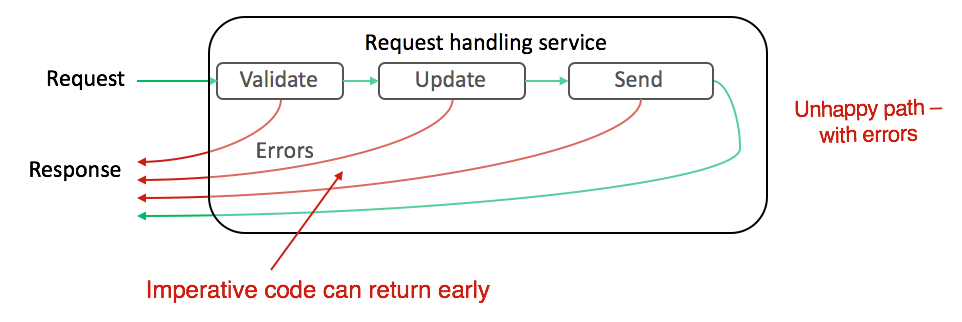
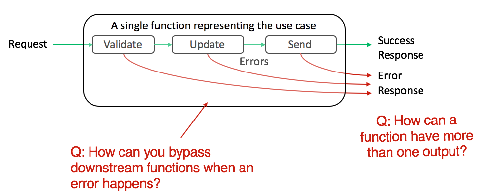

### 常见的错误处理方法

#### try-catch ####

``` ruby
begin
  ## send post request
rescue NetworkError => e
end
```

#### return code ####

``` ruby
ret = send_post_request()
if ret.code != 0
  return error
else
  parse(ret.data)
end
```

--------

#### 存在的问题 ####

复杂的业务逻辑:

* 验证用户输入
* 数据库访问
* 文件访问
* 网络问题
* ...

如果在业务逻辑中，使用上述的处理方法，代码很容易变丑，添加各种 if 判断，各种 begin-rescue。



--------

### Enter ROP(Railway Oriented Programming) ###



=>


如果 Validate 失败，就不执行 UpdateDb 操作，
如果 UpdateDb 失败，就不执行 SendEmail 操作。


实现：

``` ruby
Try = Struct.new(:ok, data_or_exception)

class Try
  def pipe(&block)
    if !@ok
      return self
    end
    block.call(@data_or_exception)
  end
end

def validate(req)
  # do your validation
  Try.new(ok, validated_req)
rescue ValidateFailed => e
  Try.new(false, e)
end

request = FakeRequest.new()
r = Try.new(true, request)
r.pipe { |req| validate(req) }
 .pipe { |req| update_db(req) }
 .pipe { |db_result| send_email(db_result) }
```


#### 不会出错的操作 ####


``` ruby
class Try
  def map(&block)
    if !@ok
      return self
    end
    result = block.call(@data_or_exception)
    Try.new(true, result)
  end
end

def trim_name(str)
  str.strip
end


request = FakeRequest.new()
r = Try.new(true, request)
r.map { |req| trim_name(req.name) }
```


### 会抛异常的操作 ###

``` ruby
class Try
  def map(&block)
    if !@ok
      return self
    end
    begin
      result = block.call(@data_or_exception)
      Try.new(true, result)
    rescue => e
      Try.new(false, e)
    end
  end
end


request = FakeRequest.new()
r = Try.new(true, request)
r.map { |req| function_may_raise_error(req) }
```


#### 副作用 ####

do something meaningful but the return value is not needed.


``` ruby
class Try
  def on_success(&block)
    if !@ok
      return self
    end
    block.call(@data_or_exception)
    return self
  end
end

def update_db(req)
  # User.save(req)
end


request = FakeRequest.new()
r = Try.new(true, request)
r.on_success { |req| update_db(req) }
```


### 串联起来

将以上操作串联起来：

``` ruby
request = FakeRequest.new()
r = Try.new(true, request)
response = r.pipe { |req| validate(req) }
 .map { |req| get_user(req.name) }
 .on_success { |req| update_db(req) }
 .pipe { |req| send_email(req) }
```


### 其他 ###

- Try
- Maybe
- Monad
