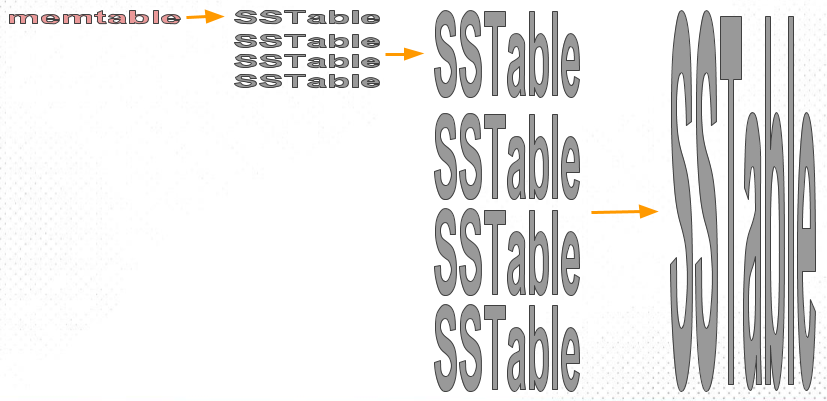
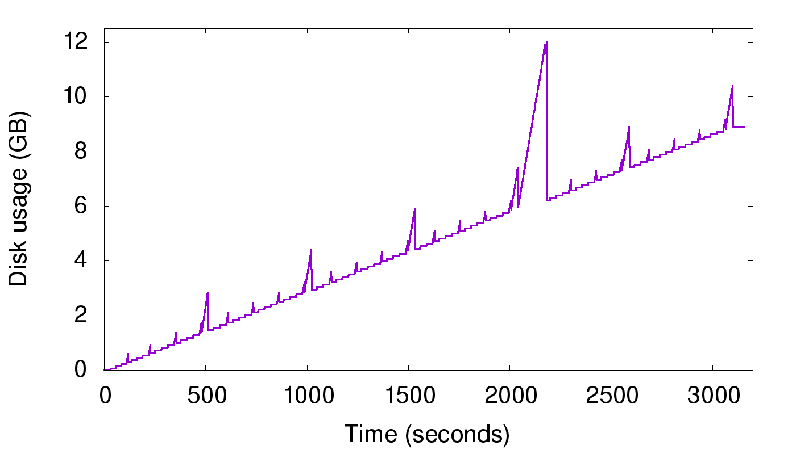
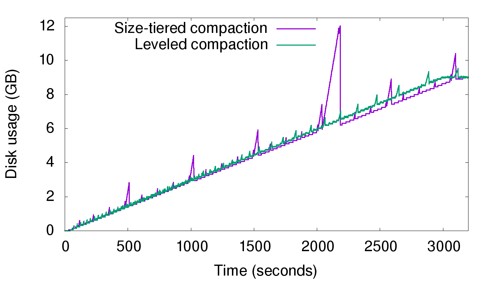

> via http://www.scylladb.com/2018/01/17/compaction-series-space-amplification/

### Size-Tiered Compaction Strategy(STCS)

memtable 定期的刷新到磁盘，成为一个一个比较小的 sstable。

当这些小的 sstable 的数量达到一定个数（比如说4个）时，这四个 sstable 会被 compact 成一个稍大些的 sstable。

当稍大些的 sstable 的数量又达到一定个数时，又会被一起 compact 成更大的 sstable。

> 实际上要复杂些，因为多个 sstable compact 在一起，可能变得更小。假如，这些 sstable 里面  key 的重复率比较高（key 的更新频率高），compact 后的 sstable 的 key 数量不会增加太多。

#### 带来的问题

**存储放大**

- 在做 compaction 的操作时，在新的 sstable 还没有生成之前，旧的 sstable 不能删除。所以 compaction 占用的空间要比实际存储的数据量多一倍。

  

- 如果 key 的更新过于频繁，会导致同一个 level 以及不同 level 的 sstable 中会存储多个相同的 key。

  

### Leveled Compaction Strategy(LCS)

> via http://www.scylladb.com/2018/01/31/compaction-series-leveled-compaction/

可减少 Size-Tiered(ST) 带来的**存储放大**问题，同时还可以减少**读放大**（每个读请求所需要的平均磁盘读取次数）。

在 ST 中，层数低的 sstable 向上组合成更大的 sstable。

Leveled 的做法是把每一层（L0层除外）的数据等分为**大小差不多（百M级别）**且 **key 不重叠**的 sstable。

1. 随着 memtable 刷新到 L0 层，L0 有足够的 sstables 时（层数越高，数目越大，一般是10的指数），这些 sstables 会向上和 L1 层的所有 sstables  一起做 compaction，并生成新的 L1 层（L1 层仍然是大小差不多且 key 不重叠的 sstables）。

2. 如果 L1 层的 sstable 个数超过限制（10个），再把这一层超出的一个 sstable，向上做 compaction。

   可以知道，L1 层的每个 sstable 的 key range 大概是总共的 1/10，L2 层的每个 sstable 的 key range 大概是总共的 1/100。所以 L1 层的这个 sstable 和 L2 层中大概 10 个 sstable 会有 key 重叠。只需要把这 10 个 sstables 和 L1 层的 sstable 做 compaction。

3. 如此往复，直到最高的一层。

#### 存储放大问题解决

STCS 中，存储放大有两个主要因素，

- compaction 时，磁盘空间占用会有临时放大一倍。
- 频繁的更新同一个 key，导致需要在不同 sstables 中存储相同 key 的不同数据。

针对第一个因素， 使用 LCS 时， 涉及到的 sstable 个数大约总是在 11 个 sstable 左右，所需要的额外的存储空间大约是个常数，`11 * size_of_per_sstable`。

针对第二个因素，使用 LCS 时，大多数的数据是存储在最高层的，而每一层的 sstables 的 key 互不重叠。

假如最高层是 L3，它有 1000 个 sstables，其他两层总共也就 110 个 sstable，从而 90% 的数据都是在 L3，最多有 10% 的数据的 key 是重复的（L1 和 L2 都是对 L3 中的数据的更新）。当然这是最好的情况。

最坏的情况是当 L3 层的 sstables 个数和 L2 层一样。L3 层大概只有 50% 的数据，这 50% 的数据可能都是重复的，存储放大大概在2倍左右。

> （当L3 层的 sstable 的个数少于 L2 或者大于 L2，重复率不可能到 50%）

[Optimizing Space Amplification in RocksDB](http://cidrdb.org/cidr2017/papers/p82-dong-cidr17.pdf) 提到了可以通过**保证 L3 层的 sstable 个数是 L2 层的10倍**来优化这种情况。

####  带来的问题

**写放大**： 每次写请求带来的总的磁盘写入开销。

一个 写入操作，首先有一个 commit log，这个是所有策略都会有的，暂且不管。

来看看 compaction （假设写入没有对 key 的覆写）：

- STCS：选择几个 sstables （假设总共 `X` bytes）来做 compaction，结果也大约是 X bytes。
- LCS：选择一个 sstable（假设总共 X bytes）来做 compaction，和更高层的大约 10 个 sstables 做 compaction，结果大约是 `11 * X` bytes。

可以看到，最差情况下，每次 compaction， LCS 的写放大是 STCS 的 11 倍。

当然某些写入场景不会达到如此差的地步。比如说，写入的数据很快会被更新掉的场景，或者是添加新数据和修改旧数据的情况不多的场景。这些情况下，LCS 大部分时间都是在低层做 compaction（L0 -> L1），compaction 过后的数据不会造成级联 compaction 现象，从而无法到达更高层上去。

虽然这么说，但事实上，LCS 并不适合大多数无法避免写的场景，更不用说写入频繁的情况。

即使写入场景只占总的 10%，一旦写入放大，比如说11倍，很容易造成磁盘带宽都被写入占用。从而：

- 读请求被拖慢。
- 如果 compaction 所需要的磁盘带宽不能被满足，会造成 L0 层的 sstable 堆积，读请求会进一步被拖慢。（sstable 过多，造成读放大）

所以虽然 LCS 解决了 STCS 的存储放大问题，但带来了更加严重的写放大，最终导致，读写都受影响。

